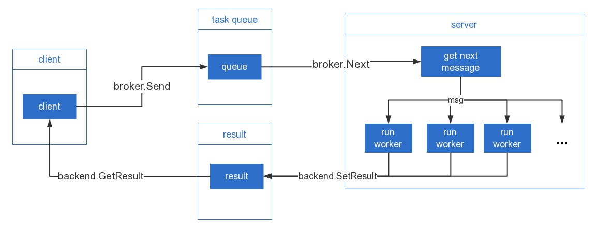

# YTask
YTask is an asynchronous task queue for handling distributed jobs in golang  
golang异步任务/队列 框架  

* [中文文档](https://doc.ikaze.cn/YTask) (Chinese document has more detailed instructions. If you know Chinese, read Chinese document)
* [En Doc](https://github.com/gojuukaze/YTask/wiki)
* [Github](https://github.com/gojuukaze/YTask)

# install
```bash
go get -u github.com/gojuukaze/YTask/v2
```
# architecture diagram



# Quick Start

## server demo

```go
package main

import (
	"context"
	"github.com/gojuukaze/YTask/v2"
	"os"
	"os/signal"
	"syscall"
)

type User struct {
	Id   int
	Name string
}

func add(a int, b int) int {
	return a + b
}

func appendUser(user User, ids []int, names []string) []User {
	var r = make([]User, 0)
	r = append(r, user)
	for i := range ids {
		r = append(r, User{ids[i], names[i]})
	}
	return r
}

func main() {
	// clientPoolSize: brokerPoolSize need not be set at server
	//                 -------------
	//                 server端不需要设置brokerPoolSize
	
	broker := ytask.Broker.NewRedisBroker("127.0.0.1", "6379", "", 0, 0)
	// poolSize: Maximum number of idle connections in the pool. If poolSize<=0 use default value
	//           default value is min(10, numWorkers) at server
	//           -------------
	//           如果poolSize<=0 会使用默认值，
	//           对于server端backend PoolSize的默认值是 min(10, numWorkers)	
	backend := ytask.Backend.NewRedisBackend("127.0.0.1", "6379", "", 0, 0)

	logger := ytask.Logger.NewYTaskLogger()  // need v2.5+
	
	ser := ytask.Server.NewServer(
		ytask.Config.Broker(&broker),
		ytask.Config.Backend(&backend),
		ytask.Config.Logger(logger),    // need v2.5+, not required
		ytask.Config.Debug(true),
		ytask.Config.StatusExpires(60*5),
		ytask.Config.ResultExpires(60*5),
	)

	ser.Add("group1", "add", add)
	ser.Add("group1", "append_user", appendUser)

	ser.Run("group1", 3)

	quit := make(chan os.Signal, 1)

	signal.Notify(quit, syscall.SIGINT, syscall.SIGTERM)
	<-quit
	ser.Shutdown(context.Background())

}
```

## client demo

```go
package main

import (
	"fmt"
	"github.com/gojuukaze/YTask/v2"
	"github.com/gojuukaze/YTask/v2/server"
	"time"
)

type User struct {
	Id   int
	Name string
}

var client server.Client

func main() {
	// clientPoolSize: Maximum number of idle connections in client pool.
	//                 If clientPoolSize<=0, clientPoolSize=10
	//
	broker := ytask.Broker.NewRedisBroker("127.0.0.1", "6379", "", 0, 5)
	
	// poolSize: Maximum number of idle connections in the pool. If poolSize<=0 use default value
	//           default value is 10 at client
	//           ---------------
	//           对于client端，如果poolSize<=0，poolSize会设为10
	backend := ytask.Backend.NewRedisBackend("127.0.0.1", "6379", "", 0, 5)

	ser := ytask.Server.NewServer(
		ytask.Config.Broker(&broker),
		ytask.Config.Backend(&backend),
		ytask.Config.Debug(true),
		ytask.Config.StatusExpires(60*5),
		ytask.Config.ResultExpires(60*5),
	)

	client = ser.GetClient()

	// task add
	taskId, _ := client.Send("group1", "add", 123, 44)
	result, _ := client.GetResult(taskId, 2*time.Second, 300*time.Millisecond)

	if result.IsSuccess() {
		sum, _ := result.GetInt64(0)
		// or
		var sum2 int
		result.Get(0, &sum2)

		fmt.Println("add(123,44) =", int(sum))
	}

	// task append user
	taskId, _ = client.Send("group1", "append_user", User{1, "aa"}, []int{322, 11}, []string{"bb", "cc"})
	result, _ = client.GetResult(taskId, 2*time.Second, 300*time.Millisecond)
	var users []User
	result.Get(0, &users)
	fmt.Println(users)

}

```

# Example

Also take a look at [example](https://github.com/gojuukaze/YTask/tree/master/example/v2) directory.

```bash
cd example/v2
go run server/main.go 

go run send/main.go
```

捐赠 / Sponsor
================

开源不易，如果你觉得对你有帮助，求打赏个一块两块的


